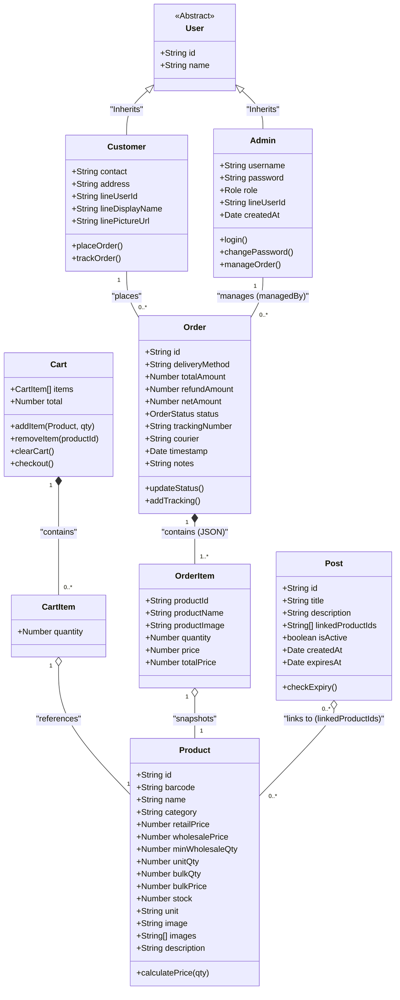

# Class Diagram ของระบบ (System Class Diagram)

เอกสารนี้แสดงโครงสร้างออบเจ็กต์/คลาสระดับแอปพลิเคชัน (อ้างอิงจาก TypeScript Interfaces ใน `src/types.ts`) ซึ่งถูกใช้จัดการข้อมูลทั้งบริเวณ Frontend React และฐานข้อมูล

---

### คำอธิบายโครงสร้างคลาส (Class Descriptions)

1. **User (Abstract)**
   - คลาสแม่สำหรับออบเจ็กต์ผู้ใช้งานในระบบ ซึ่งประกอบไปด้วยแอททริบิวต์พื้นฐานอย่าง ID และ Name

2. **Admin** (สืบทอดจาก User)
   - ตัวแทนของผู้จำหน่ายหรือผู้ดูแลระบบ มี Role เป็นตัวกำหนดสิทธิ์ย่อย มีหน้าที่จัดการคำสั่งซื้อ (`manageOrder`), เปลี่ยนแปลงข้อมูลสินค้า และเข้าสู่ระบบ (`login`)

3. **Customer** (สืบทอดจาก User)
   - ตัวแทนของลูกค้า สามารถซื้อสินค้า (`placeOrder`) ติดตามสถานะพัสดุ (`trackOrder`) และมีข้อมูลเชื่อมต่อมาจาก LINE LIFF (Line Profile) เพื่อความสะดวกในการติดต่อ

4. **Product**
   - คลาสสินค้า ทำหน้าที่เก็บรายละเอียดทุกอย่าง ตั้งแต่ภาพ, สต๊อก, จนถึงกลไกราคา (ราคาปลีก, ราคาส่ง, ราคายกลัง)
   - ฟังก์ชัน `calculatePrice(qty)` รับผิดชอบในการคำนวณราคาว่าควรจะเป็นราคาปลีก หรือราคาส่งเมื่อลูกค้าหยิบใส่ตะกร้า

5. **Order & OrderItem**
   - **Order**: ตัวแทนของบิลคำสั่งซื้อ 1 ใบ เก็บยอดรวม ยอดคืนเงิน ข้อมูลการจัดส่ง และสถานะ
   - **OrderItem**: รายการสินค้าย่อยใน 1 บิล เป็นการ Snapshot ค่าต่างๆ จาก `Product` ณ ตอนนั้น (เช่น `productName`, `price`) เพื่อป้องกันการเปลี่ยนแปลงราคาในอนาคต

6. **Cart & CartItem**
   - ตะกร้าสินค้าหน้าร้าน (อยู่บน Frontend State) มีฟังก์ชันสำหรับเพิ่ม (`addItem`), ลบ (`removeItem`), รวบยอด (`checkout`) เพื่อแปลงเป็นข้อมูลบิลในตาราง `Order` ต่อไป

7. **Post**
   - คลาสตัวแทนสำหรับโพสต์ข่าวสารและโปรโมชั่น สามารถเก็บรายการสินค้าย่อยที่เกี่ยวข้อง (`linkedProductIds`) และมีลอจิกอัตโนมัติในการซ่อนประกาศเมื่อถึงเวลา `expiresAt`
