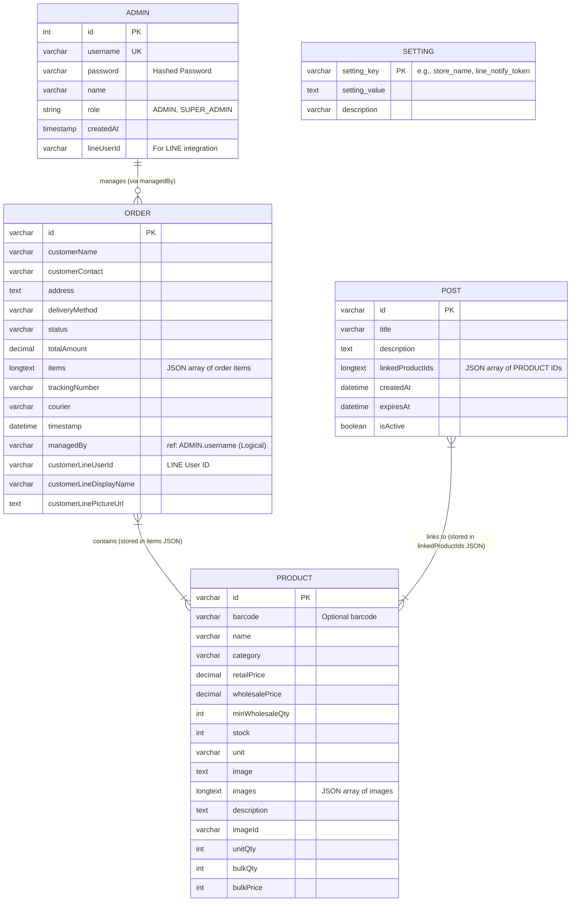

# ER Diagram ของระบบ (System Entity-Relationship Diagram)

นี่คือแผนภาพ Entity-Relationship (ER Diagram) ของตารางทั้งหมดในระบบ E-Commerce จากโครงสร้างฐานข้อมูลจริงครับ

### คำอธิบายโครงสร้างตารางหลัก:
1. **ADMIN**: เก็บข้อมูลผู้ดูแลระบบ มีการแบ่ง Role เป็น `ADMIN` กับ `SUPER_ADMIN` และมีการเชื่อมต่อกับระบบบัญชี LINE ด้วย `lineUserId`
2. **PRODUCT**: จัดเก็บข้อมูลสินค้า ราคาขายปลีก (`retailPrice`) และราคาขายส่งสำหรับการซื้อจำนวนมาก (`wholesalePrice`, `bulkPrice`, `minWholesaleQty`) รวมถึงการจัดการสต๊อกสินค้า
3. **ORDER**: เก็บข้อมูลคำสั่งซื้อทั้งหมด ฟิลด์ `items` เก็บรายการสินค้าแต่ละชิ้นไว้ในรูปแบบ JSON ทันที ทำให้ข้อมูลคำสั่งซื้อไม่พึ่งพารายการสินค้าที่อาจถูกลบไปแล้วในอนาคต `managedBy` ใช้บันทึกว่าแอดมินคนใดเป็นผู้จัดการออเดอร์นั้น
4. **POST**: ข่าวสารหรือโปรโมชั่นแบบ Post ที่สามารถผูก `PRODUCT` เข้ากับเนื้อหาได้ผ่าน `linkedProductIds`
5. **SETTING**: โครงสร้างแบบ Key-Value ง่ายๆ สำหรับเก็บการตั้งค่าของร้านค้า เช่น Token, ชื่อร้าน, หรือค่าคงที่อื่นๆ

> **หมายเหตุ** ในระบบนี้บางความสัมพันธ์ (เช่น Order Item และ Post Linked Products) ถูกเก็บเป็นไฟล์ **JSON Array (`longtext`)** ในคอลัมน์ของฐานข้อมูล แทนที่จะใช้ตารางเชื่อม (Join Query / Relationship Table) แบบดั้งเดิม เพื่อความยืดหยุ่นและความเร็วในการดึงข้อมูลครับ
