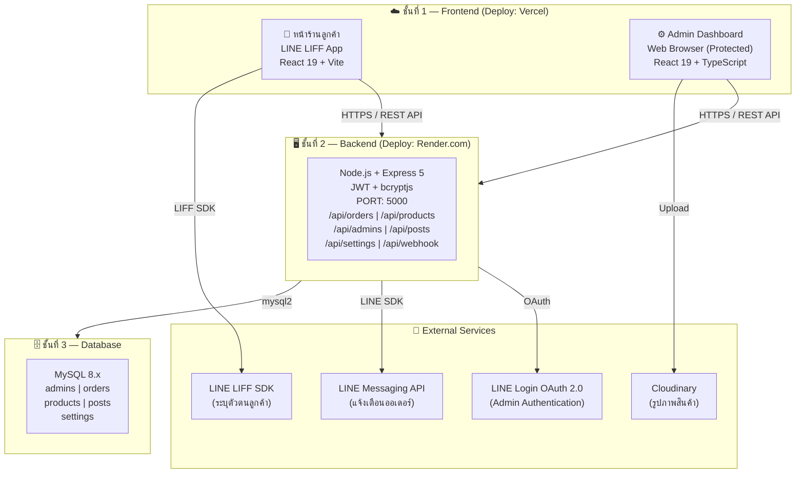

# บทนำและภาพรวมโครงการ
## ระบบ LINE Commerce Pro — วงษ์หิรัญค้าส่ง 20 บาท

**ชื่อโครงการ:** LINE Commerce Pro (linecommerce-pro)  
**วันที่จัดทำ:** 10 มีนาคม 2569  

---

## 1. ความเป็นมาและแรงจูงใจ

ในยุคที่ **LINE** กลายเป็นช่องทางการสื่อสารหลักของคนไทย ร้านค้าปลีกและค้าส่งจำนวนมากยังคงพึ่งพาการรับออเดอร์ผ่านการแชทด้วยมือ ซึ่งเกิดปัญหาตกหล่น ล่าช้า และยากต่อการติดตาม

**ร้านวงษ์หิรัญค้าส่ง 20 บาท** เป็นร้านค้าส่งสินค้าอุปโภคบริโภคราคา 20 บาท ที่มีสินค้าหลากหลายหมวดหมู่กว่า 15 ประเภท และมีลูกค้าประจำเป็นจำนวนมาก จึงมีความต้องการระบบจัดการร้านค้าออนไลน์ที่ทันสมัย ใช้งานง่าย และเชื่อมต่อกับ LINE ได้อย่างราบรื่น

โครงการนี้จึงถูกพัฒนาขึ้นเพื่อแก้ไขปัญหาดังกล่าว โดยสร้าง **แพลตฟอร์ม E-Commerce แบบครบวงจร** ที่รองรับทั้งหน้าร้านสำหรับลูกค้าและระบบหลังบ้านสำหรับผู้ดูแลระบบ

---

## 2. วัตถุประสงค์ของโครงการ

1. **พัฒนาหน้าร้านออนไลน์** บนแพลตฟอร์ม LINE LIFF ให้ลูกค้าเรียกดูสินค้าและสั่งซื้อได้โดยไม่ต้องออกจาก LINE App
2. **พัฒนาระบบ Admin Dashboard** เพื่อให้ผู้ดูแลระบบจัดการสินค้า คำสั่งซื้อ โปรโมชั่น และรายงานได้อย่างมีประสิทธิภาพ
3. **เชื่อมต่อ LINE Messaging API** เพื่อแจ้งเตือนออเดอร์แบบ Real-time ผ่าน LINE Group ของแอดมิน
4. **รองรับโครงสร้างราคาหลายระดับ** ทั้งราคาปลีก ราคาส่ง และราคายกลัง ตามลักษณะธุรกิจค้าส่ง
5. **บันทึกและติดตามออเดอร์** ได้อย่างครบถ้วน ลดความผิดพลาดจากการรับออเดอร์แบบ Manual

---

## 3. ขอบเขตของโครงการ

### 3.1 สิ่งที่อยู่ในขอบเขต (In Scope)

| หมวด | รายละเอียด |
| :--- | :--- |
| **หน้าร้านลูกค้า** | เรียกดูสินค้าตามหมวดหมู่, ตะกร้าสินค้า, กรอกข้อมูลสั่งซื้อ, ดูโปรโมชั่น, ติดตามพัสดุ |
| **ระบบ Admin** | จัดการสินค้า (CRUD + Bulk Import), จัดการออเดอร์, รายงานยอดขาย, จัดการแอดมิน, ตั้งค่าระบบ |
| **LINE Integration** | LIFF (ระบุตัวตนลูกค้า), Messaging API (แจ้งเตือนออเดอร์), LINE Login (Admin), Rich Menu |
| **ความปลอดภัย** | JWT Authentication, bcrypt Password Hashing, Role-based Access (ADMIN / SUPER_ADMIN) |
| **รายงาน** | สรุปยอดขาย, สินค้าขายดี, Export Excel/PDF |

### 3.2 สิ่งที่ไม่อยู่ในขอบเขต (Out of Scope)

- ระบบชำระเงินออนไลน์อัตโนมัติ (ระบบนี้รับโอนเงินแล้วแจ้งสลิปด้วยตัวเอง)
- แอปพลิเคชันมือถือ (iOS/Android) แบบ Native
- ระบบบัญชีและภาษี
- การจัดการซัพพลายเออร์

---

## 4. ภาพรวมระบบ (System Overview)

### 4.1 สถาปัตยกรรมระบบ

ระบบ LINE Commerce Pro เป็น **Full-Stack Web Application** แบ่งออกเป็น 3 ชั้นหลัก ได้แก่



### 4.2 ผู้ใช้งานของระบบ (Users)

| กลุ่มผู้ใช้ | ช่องทางการเข้าถึง | สิทธิ์ |
| :--- | :--- | :--- |
| **ลูกค้า** | LINE App (ผ่าน LIFF / Rich Menu) | ดูสินค้า, สั่งซื้อ, ติดตามพัสดุ |
| **แอดมิน** | Web Browser (Login ด้วย Username/Password) | จัดการสินค้า, ออเดอร์, รายงาน, โปรไฟล์ |
| **Super Admin** | Web Browser | ทุกสิทธิ์ของแอดมิน + จัดการ Users, Settings, Posts |

### 4.3 ฟีเจอร์หลักของระบบ

```
LINE Commerce Pro
│
├── 🏪 หน้าร้านลูกค้า (LINE LIFF)
│   ├── หน้าแรก — สินค้าแนะนำ, หมวดหมู่
│   ├── รายการสินค้า — ค้นหา, กรอง, ดูรายละเอียด
│   ├── ตะกร้าสินค้า — ปรับจำนวน, เลือกวิธีจัดส่ง
│   ├── สั่งซื้อ — กรอกข้อมูล, ยืนยัน
│   ├── โปรโมชั่น — โพสต์ข่าวสาร, สินค้าลดราคา
│   └── ติดตามพัสดุ — ค้นหาด้วย Order ID หรือ LINE ID
│
└── ⚙️ Admin Dashboard (Web)
    ├── 📊 Dashboard — ภาพรวม, ยอดขาย, แจ้งเตือน
    ├── 📝 จัดการออเดอร์ — ดู, เปลี่ยนสถานะ, แจ้งพัสดุ
    ├── 📈 รายงาน — ยอดขาย, Export Excel/PDF
    ├── 📦 จัดการสินค้า — CRUD, Bulk Import Excel
    ├── 📢 โปรโมชั่น — สร้าง/แก้ไขโพสต์ (SuperAdmin)
    ├── 👥 จัดการ Admin — เพิ่ม/ลบ User (SuperAdmin)
    ├── ⚙️ ตั้งค่าระบบ — บัญชีธนาคาร (SuperAdmin)
    └── 👤 โปรไฟล์ — แก้ชื่อ, เปลี่ยนรหัสผ่าน
```

---

## 5. เทคโนโลยีที่ใช้พัฒนา

| ชั้นระบบ | เทคโนโลยี | เวอร์ชัน |
| :--- | :--- | :---: |
| **Frontend Framework** | React + TypeScript | 19.x / ~5.8 |
| **Build Tool** | Vite | 6.x |
| **UI Components** | Ant Design | 6.x |
| **Styling** | Tailwind CSS | — |
| **Backend Runtime** | Node.js + Express | 20 LTS / 5.x |
| **Database** | MySQL | 8.x |
| **Auth** | JSON Web Token (JWT) + bcryptjs | 9.x / 3.x |
| **LINE SDK** | @line/bot-sdk + @line/liff | 10.x / 2.x |
| **Image Hosting** | Cloudinary | Cloud API |
| **Deploy Frontend** | Vercel | — |
| **Deploy Backend** | Render.com | — |

---

## 6. กระบวนการทำงานหลัก (Key Workflow)

### การสั่งซื้อของลูกค้า

```
1. ลูกค้ากดเมนูใน LINE (Rich Menu)
2. เปิดหน้าร้าน LIFF → ระบบดึง LINE Profile อัตโนมัติ
3. เลือกสินค้า → เพิ่มลงตะกร้า
4. ยืนยันคำสั่งซื้อ → ระบบสร้าง Order ID (เช่น ORD10-03-01)
5. Backend บันทึกออเดอร์ → ส่งแจ้งเตือนไปยัง LINE Group Admin
6. Admin รับแจ้งเตือน → เข้า Dashboard จัดการออเดอร์
7. Admin ยืนยัน → จัดส่ง → กรอกเลขพัสดุ
8. ระบบส่งเลขพัสดุแจ้งลูกค้าผ่าน LINE อัตโนมัติ
```

---

## 7. ความสำเร็จของโครงการ (Project Achievements)

โครงการนี้ได้พัฒนาและทดสอบจนสมบูรณ์ครอบคลุมฟีเจอร์ดังต่อไปนี้

| ✅ ฟีเจอร์ที่สำเร็จ | รายละเอียด |
| :--- | :--- |
| หน้าร้านค้า LINE LIFF | ครบทุกหน้า — หน้าแรก, สินค้า, รายละเอียด, ตะกร้า, โปรโมชั่น, ติดตามพัสดุ |
| ระบบ Admin Dashboard | Dashboard, Orders, Products, Reports, Posts, Users, Settings, Profile |
| Smart Order ID | สร้าง Order ID รูปแบบ `ORDDD-MM-SEQ` อัตโนมัติ ไม่ซ้ำต่อวัน |
| โครงสร้างราคา 3 ระดับ | ปลีก / ส่ง (ตามจำนวน) / ยกลัง (Step Price) คำนวณอัตโนมัติ |
| LINE Messaging API | แจ้งเตือน Group Admin เมื่อมีออเดอร์, ส่งเลขพัสดุให้ลูกค้า |
| JWT Authentication | Login, ออก Token, เปลี่ยนรหัสผ่าน, Role-based Access |
| โปรไฟล์ Admin | ดูข้อมูล, แก้ชื่อแสดงผล, เปลี่ยนรหัสผ่าน |
| Bulk Import | นำเข้าสินค้าจาก Excel หลายร้อยรายการพร้อมกัน |
| Export รายงาน | Excel (.xlsx) และ PDF ทั้ง Report และใบสั่งซื้อ |
| Responsive Design | ใช้งานได้ทั้งมือถือและ Desktop |
| Deploy Production | Frontend บน Vercel, Backend บน Render.com |

---

## 8. เอกสารที่เกี่ยวข้อง

| เอกสาร | คำอธิบาย |
| :--- | :--- |
| [SRS.md](./SRS.md) | Software Requirements Specification — ความต้องการของระบบฉบับเต็ม |
| [API_Documentation.md](./API_Documentation.md) | รายละเอียด REST API ทุก Endpoint |
| [ER_Diagram.md](./ER_Diagram.md) | Entity-Relationship Diagram ของฐานข้อมูล |
| [Class_Diagram.md](./Class_Diagram.md) | Class Diagram ของระบบ |
| [Data_Dictionary.md](./Data_Dictionary.md) | พจนานุกรมข้อมูล (รายละเอียดทุก Column) |
| [Master_Data.md](./Master_Data.md) | ข้อมูล Lookup/Reference ที่ใช้ในระบบ |
| [Development_Environment.md](./Development_Environment.md) | สภาพแวดล้อมและเครื่องมือในการพัฒนา |
| [Test_Cases.md](./Test_Cases.md) | Test Cases สำหรับทดสอบระบบ |

---

*เอกสารนี้จัดทำเพื่อสรุปและปิดโครงการ LINE Commerce Pro — วงษ์หิรัญค้าส่ง 20 บาท*  
*วันที่ปิดโครงการ: 10 มีนาคม 2569*
